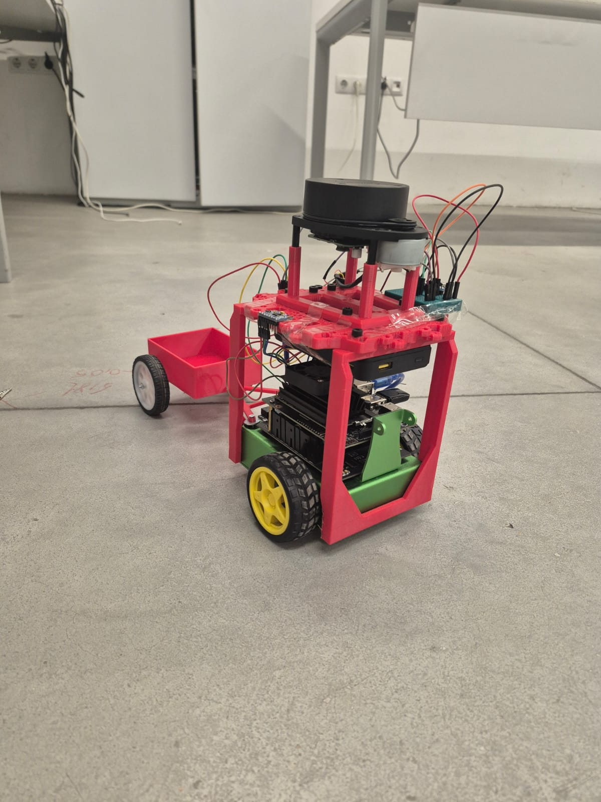
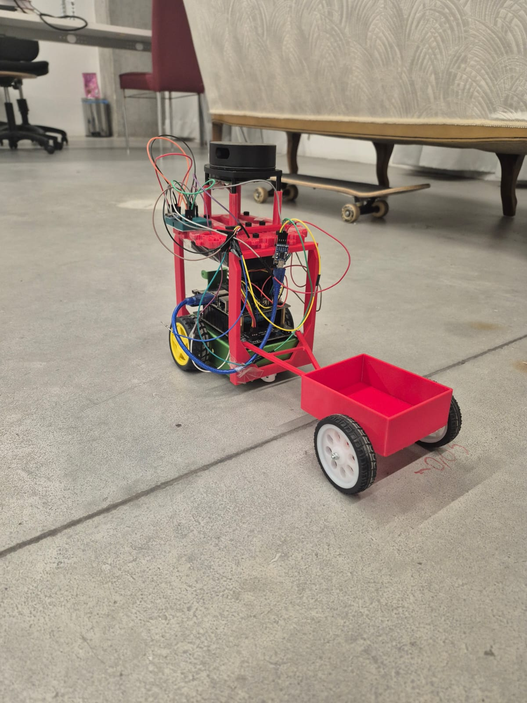
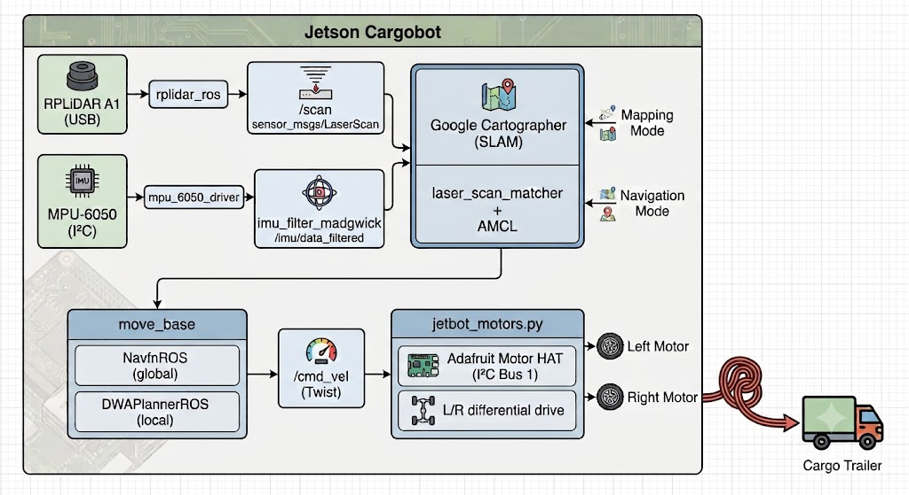

<p align="center">
  
  &nbsp;&nbsp;&nbsp;
  
</p>

<h1 align="center">🤖 CargoBot</h1>
<p align="center">
  <b>Autonomous Ground Cargo Robot</b><br/>
  <i>Graduation Project — 2026</i>
</p>

<p align="center">
  
  
  
  
  
</p>

---

## 📋 Table of Contents

- [Overview](#overview)
- [Key Features](#key-features)
- [Hardware](#hardware)
- [System Architecture](#system-architecture)
- [Software Stack](#software-stack)
- [ROS Packages](#ros-packages)
- [Getting Started](#getting-started)
  - [Prerequisites](#prerequisites)
  - [Installation](#installation)
- [Usage](#usage)
  - [1. Bringup](#1-bringup)
  - [2. Mapping (SLAM)](#2-mapping-slam)
  - [3. Autonomous Navigation](#3-autonomous-navigation)
  - [4. Send a Goal](#4-send-a-goal)
- [TF Tree](#tf-tree)
- [Project Structure](#project-structure)
- [Configuration Reference](#configuration-reference)
- [License](#license)

---

## Overview

**CargoBot** is an autonomous ground cargo delivery robot built as a graduation project. It is based on a modified [Waveshare JetBot 2GB](https://www.waveshare.com/wiki/JetBot_2GB_AI_Kit) chassis, upgraded with a **2D LiDAR** and an **IMU** for real-time sensor fusion. The robot uses **Google Cartographer** for SLAM (Simultaneous Localization and Mapping) and the **ROS Navigation Stack** for fully autonomous point-to-point navigation.

A custom 3D-printed cargo trailer is attached to the rear of the robot, enabling it to carry and deliver small payloads autonomously within mapped indoor environments.

---

## Key Features

| Feature | Details |
|---|---|
| **Autonomous Navigation** | Goal-based path planning with obstacle avoidance via `move_base` + DWA local planner |
| **SLAM** | Real-time 2D map building with Google Cartographer (LiDAR + IMU fusion) |
| **Localization** | AMCL particle-filter localization on pre-built maps with `laser_scan_matcher` odometry |
| **Sensor Fusion** | RPLiDAR A1 laser scans fused with MPU-6050 IMU data (Madgwick filter) |
| **Differential Drive** | Adafruit Motor HAT controlled via `cmd_vel` with dead-zone and clamping |
| **Cargo Trailer** | 3D-printed detachable trailer for payload delivery |
| **Edge Computing** | All processing runs on-board the NVIDIA Jetson Nano 2GB |

---

## Hardware

| Component | Specification |
|---|---|
| **Compute** | NVIDIA Jetson Nano 2GB Developer Kit |
| **Chassis** | Waveshare JetBot 2GB AI Kit (modified) |
| **LiDAR** | RPLiDAR A1 — 360° 2D laser scanner (12 m range) |
| **IMU** | MPU-6050 6-axis (3-axis gyro + 3-axis accelerometer) |
| **Motor Driver** | Adafruit DC Motor HAT (I²C, PCA9685-based) |
| **Motors** | 2× DC geared motors (differential drive) |
| **Camera** | CSI camera module (on-board, for future vision tasks) |
| **Trailer** | Custom 3D-printed cargo tray with passive caster wheels |
| **Power** | Portable battery pack |

---

## System Architecture

<p align="left">
  
</p>

---

## Software Stack

| Layer | Technology |
|---|---|
| **OS** | Ubuntu 18.04 (JetPack 4.x) |
| **Middleware** | ROS Melodic |
| **SLAM** | Google Cartographer (`cartographer_ros`) |
| **Localization** | AMCL (Adaptive Monte Carlo Localization) |
| **Odometry** | `laser_scan_matcher` + custom `pose_to_odom` bridge |
| **IMU Filtering** | `imu_filter_madgwick` (orientation estimation) |
| **Path Planning** | `move_base` — NavfnROS (global) + DWA (local) |
| **Motor Control** | Adafruit MotorHAT Python driver (I²C / PCA9685) |
| **Robot Model** | URDF (base_link, wheels, camera, laser, imu_link) |

---

## ROS Packages

```
catkin_ws/src/
├── cartographer_config   # Cartographer SLAM configuration & launch
├── imu_bringup           # MPU-6050 driver + Madgwick filter launch
├── imu_tf                # IMU → base_link TF broadcaster
├── jetbot_bringup        # Top-level bringup (URDF + motors)
├── jetbot_description    # URDF model & robot_state_publisher launch
├── jetbot_navigation     # move_base, AMCL, laser_scan_matcher, configs
├── jetbot_ros            # Motor driver, OLED display, teleop scripts
├── mpu_6050_driver       # Raw MPU-6050 I²C reader → /imu/data
├── ros_deep_learning     # NVIDIA deep learning inference nodes (future)
└── rplidar_ros           # RPLiDAR A1 ROS driver → /scan
```

### Package Details

| Package | Purpose | Key Files |
|---|---|---|
| `cartographer_config` | Google Cartographer 2D SLAM tuning | `config/jetbot_2d.lua`, `launch/cartographer.launch` |
| `imu_bringup` | Launches MPU-6050 driver + Madgwick filter pipeline | `launch/imu.launch` |
| `imu_tf` | Broadcasts `base_link → imu_link` transform from filtered IMU | `scripts/imu_tf_broadcaster.py` |
| `jetbot_bringup` | One-shot bringup of URDF + motors | `launch/bringup_essentials.launch` |
| `jetbot_description` | URDF model definition (links, joints, sensors) | `urdf/jetbot.urdf` |
| `jetbot_navigation` | Full navigation stack (AMCL, move_base, DWA, costmaps) | `launch/`, `config/`, `scripts/` |
| `jetbot_ros` | Low-level motor control + teleop | `scripts/jetbot_motors.py`, `scripts/teleop_key.py` |
| `mpu_6050_driver` | Raw I²C communication with MPU-6050 sensor | `scripts/imu_node.py` |
| `rplidar_ros` | RPLiDAR A1 ROS wrapper (publishes `/scan`) | `launch/`, `src/` |

---

## Getting Started

### Prerequisites

- **NVIDIA Jetson Nano 2GB** with JetPack 4.x (Ubuntu 18.04)
- **ROS Melodic** fully installed ([installation guide](http://wiki.ros.org/melodic/Installation/Ubuntu))
- **Python 2.7** (ROS Melodic default)
- Hardware connected:
  - RPLiDAR A1 via USB (`/dev/ttyUSB0`)
  - MPU-6050 via I²C (bus 1)
  - Adafruit Motor HAT via I²C (bus 1)

### Installation

```bash
# 1. Clone this repository
git clone https://github.com/ahmetsalihkaya/GradProject-CargoBot.git
cd CargoBot/workspace/catkin_ws

# 2. Install ROS dependencies
sudo apt-get update
sudo apt-get install -y \
    ros-melodic-cartographer-ros \
    ros-melodic-move-base \
    ros-melodic-amcl \
    ros-melodic-map-server \
    ros-melodic-dwa-local-planner \
    ros-melodic-laser-scan-matcher \
    ros-melodic-imu-filter-madgwick \
    ros-melodic-robot-state-publisher \
    ros-melodic-tf \
    ros-melodic-tf2-ros

# 3. Install Python dependencies
pip install Adafruit-MotorHAT smbus2

# 4. Build the workspace
catkin_make

# 5. Source the workspace
echo "source $(pwd)/devel/setup.bash" >> ~/.bashrc
source devel/setup.bash

# 6. Set USB permissions for RPLiDAR
sudo chmod 666 /dev/ttyUSB0
```

---

## Usage

### 1. Bringup

Start the core robot systems — URDF, motors, LiDAR, and IMU:

```bash
# Terminal 1: Robot base (URDF + motors)
roslaunch jetbot_bringup bringup_essentials.launch

# Terminal 2: LiDAR
roslaunch rplidar_ros rplidar.launch

# Terminal 3: IMU pipeline (MPU-6050 + Madgwick filter)
roslaunch imu_bringup imu.launch
```

### 2. Mapping (SLAM)

Build an occupancy grid map of your environment using Google Cartographer:

```bash
# Terminal 4: Start Cartographer SLAM
roslaunch cartographer_config cartographer.launch

# Terminal 5: Visualize in RViz
roslaunch jetbot_description rviz.launch

# Drive the robot around using teleop
rosrun jetbot_ros teleop_key.py
```

Once the map is complete, save it:

```bash
# Save the map for navigation
rosrun map_server map_saver -f $(rospack find jetbot_navigation)/maps/my_map
```

### 3. Autonomous Navigation

Load a pre-built map and navigate autonomously:

```bash
# Terminal 4: Odometry (laser scan matcher + pose-to-odom bridge)
roslaunch jetbot_navigation laser_scan_matcher.launch

# Terminal 5: Localization (AMCL + map server)
roslaunch jetbot_navigation amcl.launch

# Terminal 6: Path planning & obstacle avoidance
roslaunch jetbot_navigation move_base.launch
```

### 4. Send a Goal

Send a navigation goal from the command line:

```bash
# Usage: goal_publisher.py <x> <y> <yaw_radians>
rosrun jetbot_navigation goal_publisher.py 1.0 2.5 0.0
```

Or use **RViz** → click **"2D Nav Goal"** to set goals interactively on the map.

---

## TF Tree

```
map
 └── odom                    (published by AMCL: map → odom)
      └── base_link          (published by pose_to_odom: odom → base_link)
           ├── left_wheel    (robot_state_publisher, from URDF)
           ├── right_wheel   (robot_state_publisher, from URDF)
           ├── camera_link   (robot_state_publisher, from URDF)
           ├── laser         (robot_state_publisher, from URDF)
           └── imu_link      (robot_state_publisher, from URDF)
```

---

## Project Structure

```
CargoBot/
├── README.md
├── docs/
│   ├── cargobot_side.jpeg       # Robot photo — side view
│   └── cargobot_rear.jpeg       # Robot photo — rear view with trailer
└── workspace/
    └── catkin_ws/
        ├── .catkin_workspace
        ├── build/
        ├── devel/
        └── src/
            ├── cartographer_config/
            │   ├── config/jetbot_2d.lua
            │   └── launch/cartographer.launch
            ├── imu_bringup/
            │   └── launch/imu.launch
            ├── imu_tf/
            │   └── scripts/imu_tf_broadcaster.py
            ├── jetbot_bringup/
            │   └── launch/bringup_essentials.launch
            ├── jetbot_description/
            │   ├── launch/
            │   │   ├── jetbot_rsp.launch
            │   │   └── rviz.launch
            │   └── urdf/jetbot.urdf
            ├── jetbot_navigation/
            │   ├── config/
            │   │   ├── amcl.yaml
            │   │   ├── laser_scan_matcher.yaml
            │   │   └── move_base/
            │   │       ├── costmap_common_params.yaml
            │   │       ├── dwa_local_planner_params.yaml
            │   │       ├── global_costmap_params.yaml
            │   │       └── local_costmap_params.yaml
            │   ├── launch/
            │   │   ├── amcl.launch
            │   │   ├── laser_scan_matcher.launch
            │   │   └── move_base.launch
            │   ├── maps/
            │   │   ├── my_map.pbstream
            │   │   ├── my_map.pgm
            │   │   └── my_map.yaml
            │   └── scripts/
            │       ├── goal_publisher.py
            │       └── pose_to_odom.py
            ├── jetbot_ros/
            │   └── scripts/
            │       ├── jetbot_motors.py
            │       ├── jetbot_oled.py
            │       ├── teleop_joy.py
            │       └── teleop_key.py
            ├── mpu_6050_driver/
            │   └── scripts/imu_node.py
            ├── ros_deep_learning/
            └── rplidar_ros/
```

---

## Configuration Reference

### Cartographer SLAM (`jetbot_2d.lua`)

| Parameter | Value | Notes |
|---|---|---|
| `tracking_frame` | `imu_link` | IMU-referenced tracking for better scan alignment |
| `use_imu_data` | `true` | Fuses IMU orientation with LiDAR scans |
| `min_range` / `max_range` | 0.1 m / 8 m | RPLiDAR A1 effective range |
| `optimize_every_n_nodes` | `0` | Disabled in localization mode (set to 35 for mapping) |

### DWA Local Planner

| Parameter | Value | Notes |
|---|---|---|
| `max_vel_x` | 0.4 m/s | Maximum forward speed |
| `max_vel_theta` | 2.0 rad/s | Maximum rotation speed |
| `xy_goal_tolerance` | 0.10 m | 10 cm goal reach threshold |
| `yaw_goal_tolerance` | 6.28 rad | Full-circle tolerance (heading not constrained) |

### AMCL Localization

| Parameter | Value | Notes |
|---|---|---|
| `min_particles` / `max_particles` | 250 / 1000 | Particle filter bounds |
| `laser_model_type` | `likelihood_field` | Probabilistic laser model |
| `odom_model_type` | `diff-corrected` | Differential drive odometry model |
| `update_min_d` | 0.01 m | Re-localize after 1 cm movement |

### Robot Physical Parameters

| Parameter | Value |
|---|---|
| Wheel separation | 0.125 m |
| Wheel radius | 0.03 m |
| Robot radius (costmap) | 0.10 m |
| Inflation radius | 0.20 m |
| Max PWM | 115 |

---

## License

This project is open-source and available under the [MIT License](LICENSE).

---

<p align="center">
  <i>Built with ❤️ as a graduation project — 2026</i>
</p>
